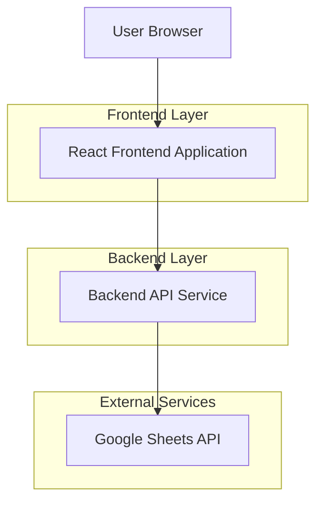
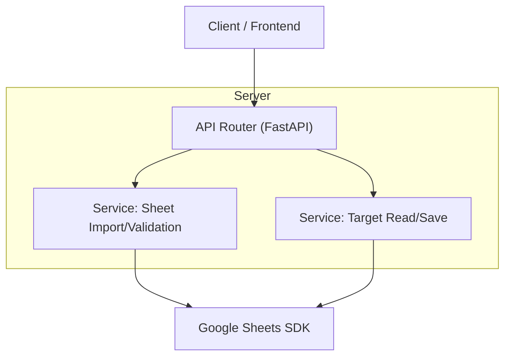

## 1.Architecture design


## 2.Technology Description
- Frontend: React@18 + vite + tailwindcss@3
- Backend: FastAPI (Python) (lưu trữ an toàn thông tin xác thực Google, gọi Google Sheets API)
- Database: None (dữ liệu nguồn và dữ liệu cập nhật có thể đọc/ghi trực tiếp qua Google Sheet theo phạm vi MVP)

## 3.Route definitions
| Route | Purpose |
|---|---|
| / | Trang chủ: điều hướng, chọn kỳ/đợt, trạng thái đồng bộ gần nhất |
| /google-sheet-import | Nhập dữ liệu từ Google Sheet: cấu hình nguồn, xem trước, kiểm tra lỗi |
| /targets | Giao/điều chỉnh chỉ tiêu: cây phân cấp CN/PGD, bảng nhập/điều chỉnh, kiểm tra tổng, lưu |

## 4.API definitions (If it includes backend services)
### 4.1 Core types (TypeScript)
```ts
export type UnitType = "CN" | "PGD";

export type TargetLevel =
  | "TINH" | "XA"      // cho CN: tỉnh -> xã
  | "THON";            // cho PGD: xã -> thôn (hiển thị cấp thôn dưới xã)

export type TargetRow = {
  period: string;        // kỳ/đợt (vd: "2026-Q2" hoặc "2026-04")
  unitType: UnitType;
  unitCode: string;      // mã đơn vị (tỉnh/xã/thôn tùy cấp)
  unitName: string;
  level: TargetLevel;
  parentUnitCode?: string;
  targetValue: number;
};

export type ImportPreview = {
  period: string;
  source: { sheetUrl: string; sheetName: string };
  rows: TargetRow[];
  errors: { rowIndex: number; message: string }[];
};
```

### 4.2 Google Sheet import
```
POST /api/sheets/preview
```
Request:
| Param Name | Param Type | isRequired | Description |
|---|---:|---:|---|
| sheetUrl | string | true | Link Google Sheet |
| sheetName | string | true | Tên tab (worksheet) |
| period | string | true | Kỳ/đợt áp dụng |

Response:
| Param Name | Param Type | Description |
|---|---|---|
| preview | ImportPreview | Dữ liệu xem trước kèm lỗi kiểm tra |

### 4.3 Read targets (from imported source)
```
GET /api/targets?unitType=CN&period=2026-Q2
```
Response: `TargetRow[]`

### 4.4 Save adjusted targets
```
POST /api/targets/save
```
Request:
| Param Name | Param Type | isRequired | Description |
|---|---:|---:|---|
| period | string | true | Kỳ/đợt |
| unitType | UnitType | true | CN hoặc PGD |
| rows | TargetRow[] | true | Danh sách chỉ tiêu đã điều chỉnh |

Response:
| Param Name | Param Type | Description |
|---|---|---|
| success | boolean | Lưu thành công/không |
| message | string | Thông báo lỗi nếu có |

## 5.Server architecture diagram (If it includes backend services)


## 6.Data model(if applicable)
(Không yêu cầu cơ sở dữ liệu trong phạm vi hiện tại.)
