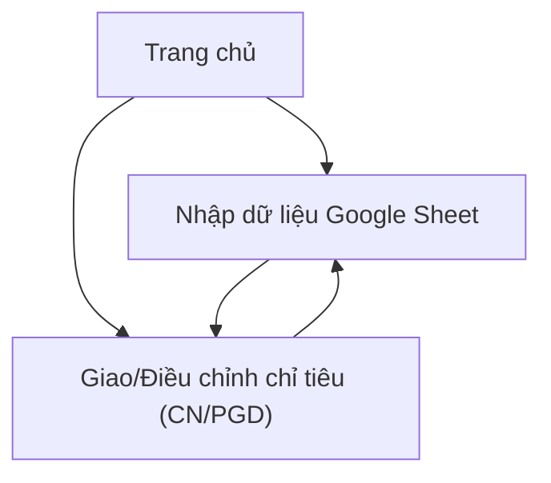

## 1. Product Overview
Màn hình giao/điều chỉnh chỉ tiêu cho hệ thống Chi nhánh (CN) và Phòng giao dịch (PGD), với dữ liệu đầu vào nhập từ Google Sheet.
Hỗ trợ phân cấp quản lý: CN theo tỉnh→xã; PGD theo xã→thôn để phân bổ và điều chỉnh chỉ tiêu nhất quán.

## 2. Core Features

### 2.1 Feature Module
Sản phẩm tối thiểu gồm các trang chính sau:
1. **Trang chủ**: điều hướng, chọn kỳ/đợt áp dụng, trạng thái đồng bộ Google Sheet gần nhất.
2. **Nhập dữ liệu Google Sheet**: khai báo link sheet/tab, tải dữ liệu, xem trước & kiểm tra lỗi dữ liệu.
3. **Giao/Điều chỉnh chỉ tiêu (CN/PGD)**: chọn đơn vị & cấp phân bổ, hiển thị cây phân cấp, nhập/điều chỉnh chỉ tiêu, kiểm tra tổng và lưu.

### 2.3 Page Details
| Page Name | Module Name | Feature description |
|---|---|---|
| Trang chủ | Điều hướng & ngữ cảnh kỳ | Chọn kỳ/đợt áp dụng; điều hướng tới Nhập dữ liệu và Giao/Điều chỉnh; hiển thị trạng thái đồng bộ gần nhất (thành công/thất bại, thời gian). |
| Nhập dữ liệu Google Sheet | Khai báo nguồn | Nhập link Google Sheet và tên tab (sheet); chọn kỳ/đợt áp dụng cho lần nhập. |
| Nhập dữ liệu Google Sheet | Đồng bộ & kiểm tra | Tải dữ liệu từ Google Sheet; hiển thị bảng xem trước; kiểm tra hợp lệ tối thiểu (thiếu mã đơn vị/cấp/giá trị chỉ tiêu, trùng dòng theo khóa); cho phép tải lại sau khi sửa trên Sheet. |
| Giao/Điều chỉnh chỉ tiêu (CN/PGD) | Chọn phạm vi | Chọn loại đơn vị (CN hoặc PGD); chọn đơn vị gốc để thao tác; hiển thị đúng phân cấp (CN: tỉnh→xã; PGD: xã→thôn). |
| Giao/Điều chỉnh chỉ tiêu (CN/PGD) | Cây phân cấp & bảng chỉ tiêu | Hiển thị cây đơn vị theo phân cấp; hiển thị bảng chỉ tiêu của các nút con; hỗ trợ nhập mới/điều chỉnh giá trị chỉ tiêu theo từng đơn vị con. |
| Giao/Điều chỉnh chỉ tiêu (CN/PGD) | Kiểm tra tổng & lưu | Tự động tính tổng theo cấp; cảnh báo khi tổng cấp con vượt/khác tổng cấp cha (nếu có tổng cha); lưu kết quả điều chỉnh để sử dụng lại (theo kỳ/đợt). |

## 3. Core Process
**Luồng nhập dữ liệu từ Google Sheet**: Bạn vào trang Nhập dữ liệu, dán link Google Sheet và tab, chọn kỳ/đợt, tải dữ liệu và xem trước; nếu có lỗi, bạn sửa trên Google Sheet và tải lại.

**Luồng giao/điều chỉnh chỉ tiêu**: Bạn chọn loại đơn vị (CN/PGD), chọn đơn vị gốc và kỳ/đợt; hệ thống hiển thị cây phân cấp phù hợp (CN: tỉnh→xã; PGD: xã→thôn); bạn nhập/điều chỉnh chỉ tiêu cho từng đơn vị con, kiểm tra tổng và lưu.

